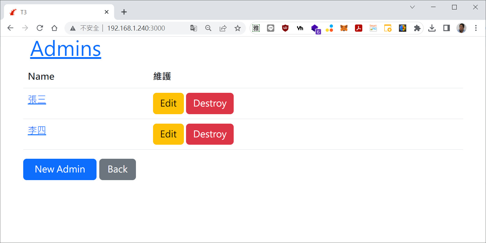
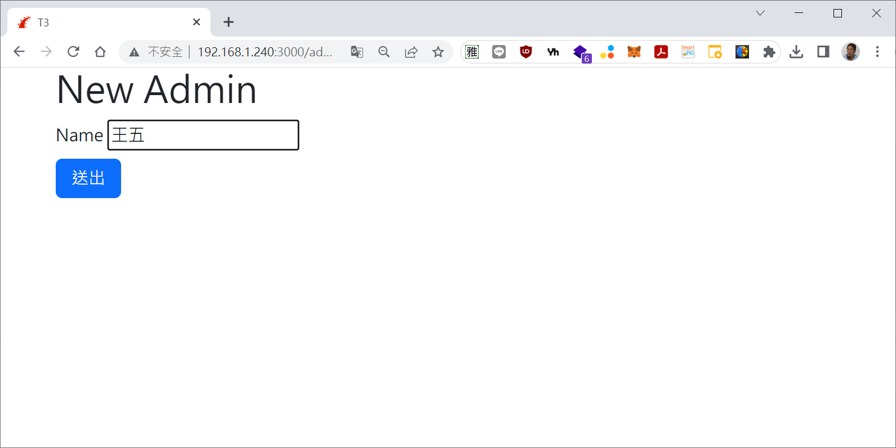
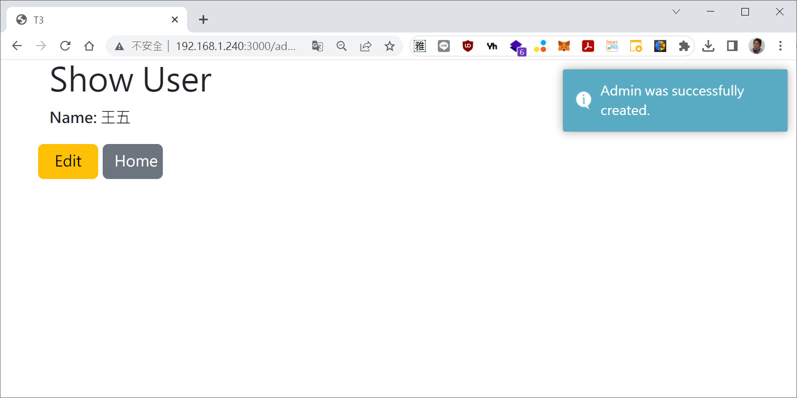
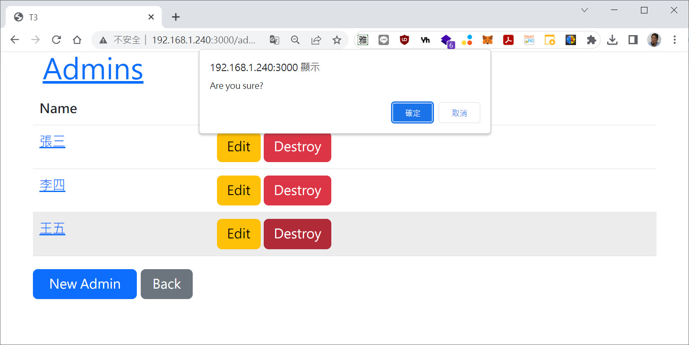
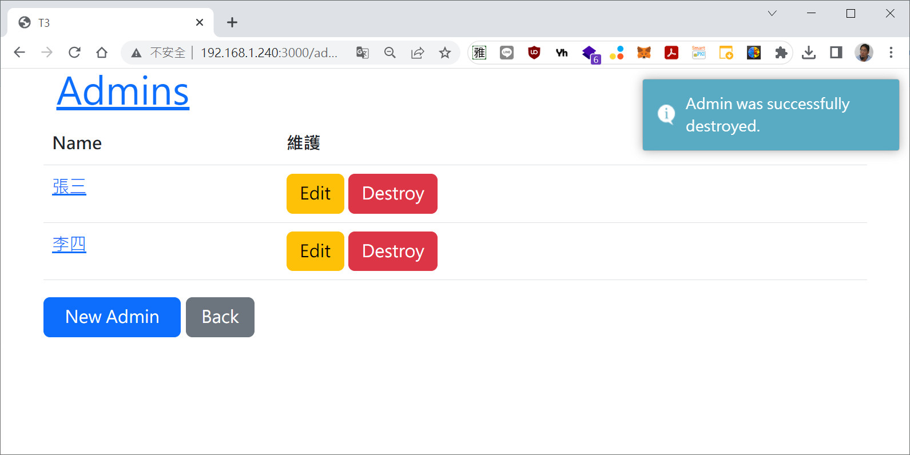

# ●Toastr - Bootstrap5 快閃提示

* 取代 bootstrap_flash_messages 和 bootstrap-rails-flash 。這兩個最多只支援到 Bootstrap 4。


1. ruby -v  #v2.7.7

2. rails -v  #v5.2.8.1

3. rails \_5.2.8.1\_ new toastr

4. cd toastr

5. vi Gemfile  #加入 

   ```
   gem 'webdrivers'
   gem 'devise'
   gem 'jquery-rails'
   gem 'chosen-rails'
   gem 'toastr-rails'
   gem 'bootstrap'
   gem 'bootstrap_form'
   gem 'font-awesome-rails'
   ```

6. bundle  #安裝套件

7. rails g scaffold Admin name  #用腳手架快速建立 admin MVC (Model、View、Controller)。

8. vi app/assets/stylesheets/application.scss  #先全部刪除後加入

   ```ruby
   @import "bootstrap";
   @import "rails_bootstrap_forms";
   @import "font-awesome";
   @import "toastr";
   ```

9. vi app/assets/javascripts/application.js  #修改成為

   ```ruby
   //= require rails-ujs
   //= require activestorage
   //= require turbolinks
   //= require jquery3
   //= require toastr
   //= require chosen-jquery
   //= require popper
   //= require bootstrap
   //= require_tree .
   
   
   $(document).ready(function() {
   
   
    toastr.options = {
                     "closeButton": false,
                     "debug": false,
                     "positionClass": "toast-bottom-right",
                     "onclick": null,
                     "showDuration": "300",
                     "hideDuration": "1000",
                     "timeOut": "5000",
                     "extendedTimeOut": "1000",
                     "showEasing": "swing",
                     "hideEasing": "linear",
                     "showMethod": "fadeIn",
                     "hideMethod": "fadeOut"
                 }
   
   });
   ```

10. vi app/views/layouts/application.html.erb  #加入Bootstrap標籤(container、row)。

  ```ruby
  <html>
    <head>
      <title>Toastr</title>
      <%= csrf_meta_tags %>
      <%= csp_meta_tag %>
  
      <%= stylesheet_link_tag    'application', media: 'all', 'data-turbolinks-track': 'reload' %>
      <%= javascript_include_tag 'application', 'data-turbolinks-track': 'reload' %>
    </head>
  
    <body>
    <% unless flash.empty? %>
      <script type="text/javascript">
        <% flash.each do |f| %>
          <% type = f[0].to_s.gsub('alert', 'error').gsub('notice', 'info') %>
          toastr['<%= type %>']('<%= f[1] %>');
        <% end %>
      </script>
    <% end %>
  
      <div class='container'>
        <div class='row'>
          <%= yield %>
        </div>
      </div>
    </body>
  </html>
  ```

11. vi app/views/index.html.erb

   ```ruby
   <h1><%= link_to 'Admins', root_path %></h1>
   
   <table class='table table-hover'>
     <thead>
       <tr bgcolor='#CCC'>
         <th>Name</th>
         <th>維護</th>
       </tr>
     </thead>
   
     <tbody>
       <% @admins.each do |admin| %>
         <tr>
           <td><%= link_to admin.name, admin %></td>
           <td>
             <%= link_to 'Edit', edit_admin_path(admin), class: 'btn btn-warning' %>
             <%= link_to 'Destroy', admin, method: :delete, data: { confirm: 'Are you sure?' }, class: 'btn btn-danger' %></td>
         </tr>
       <% end %>
     </tbody>
   </table>
   
   <br>
   
   <%= link_to 'New Admin', new_admin_path, class: 'btn btn-primary col-2' %>
   &nbsp;<%= link_to 'Back', :back, class: 'btn btn-secondary col-1' %>
   ```

   

12. vi app/views/new.html.erb

   ```ruby
   <h1>New Admin</h1>
   <%= render 'form', admin: @admin %>
   ```

   

13. vi app/views/edit.html.erb

   ```ruby
   <h1>Editing Admin</h1>
   <%= render 'form', admin: @admin %>
   ```

   

14. vi app/views/show.html.erb

   ```ruby
   <h1>Show User</h1>
   
   <p>
     <strong>Name:</strong>
     <%= @admin.name %>
   </p>
   
   <%= link_to 'Edit', edit_admin_path(@admin), class: 'btn btn-warning col-1' %>
   &nbsp;<%= link_to 'Home', admins_path, class: 'btn btn-secondary col-1'  %>
   ```

   

15. vi app/views/_form.html.erb

   ```ruby
   <%= form_with(model: admin, local: true) do |form| %>
     <% if admin.errors.any? %>
       <div id="error_explanation">
         <h2><%= pluralize(admin.errors.count, "error") %> prohibited this admin from being saved:</h2>
   
         <ul>
         <% admin.errors.full_messages.each do |message| %>
           <li><%= message %></li>
         <% end %>
         </ul>
       </div>
     <% end %>
   
     <div class="field">
       <%= form.label :name %>
       <%= form.text_field :name %>
     </div>
   
     <div class="actions">
       <%= form.submit "送出", class: 'btn btn-primary col-1 mt-2' %>
     </div>
   <% end %>
   ```


16. vi config/routes.rb

   ```ruby
   Rails.application.routes.draw do
     resources :admins
     root to: 'admins#index'
   end
   ```

17. 啟動 Webbrick 開發網站 

    ```ruby
    rails s -b 0.0.0.0
    ```

18. 開啟瀏覽器，輸入網址即可測試

    ```
    http://localhost:3000 或 http://[ip]:3000
    ```













---
= END =
      
